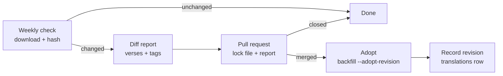

# Handling upstream source revisions

Status: proposed (2026-09-24). Discussion copy: [Claude Docs](https://claude.ai/code/artifact/0f67199b-e532-4a33-9183-0b19c5b9c9e3). The procedure that works today is in [Updating a translation](../../AGENTS.md#updating-a-translation) and the [word study runbook](../runbooks/word-study-prod-migration.md).

The API should notice when eBible or a word-tagging source changes, show the change as a verse-level diff, and adopt it deliberately, one translation at a time, with word tags rebuilt to match. Today none of that happens: production drifted from its sources without anyone knowing.

## Problem

Production had silently fallen behind its sources. The word-study backfill found it by comparing every stored verse with a fresh parse, in production, on 2026-09-24.

| Translation | Verses behind the current source | Kind of change | What we did |
| --- | --- | --- | --- |
| tcgnt | 1,215 of 7,954 | 869 punctuation, 296 accents/breathings/capitals, 49 wording | Adopted, so word tags match |
| web | 143 of 37,499 | Wording ("in the earth" → "on the earth"); eBible zip dated 2026-09-22 | Left as is |
| kjv | 3 of 36,822 | Apocrypha wording (Tob 3:10, Bar 6:59, 1 Macc 10:87) | Left as is |
| wlc | 0 | — | — |

Four things in the pipeline let this go unnoticed:

- **Unversioned downloads.** The eBible URLs always serve the latest revision, and `data:download` skips files already on disk. Each machine keeps whichever revision it first fetched, and an older one can't be downloaded again.
- **Insert-only seeding.** `db:seed` uses `INSERT OR IGNORE`, so re-seeding never changes an existing verse.
- **No record of the revision.** Nothing stores which source file a translation was imported from.
- **Tags depend on exact text.** A tagged translation (`tcgnt`, `wlc`) whose text changes without re-tagging serves tags that no longer pair with its words. The web client then drops that verse's tags.

The word-tagging sources (byztxt, STEPBible, Strong's) are pinned to commits, so they change only when we bump them. The Bible texts are the gap.

## Proposal

Treat a source revision like a code change: detect it on a schedule, review it as a pull request, adopt it with the existing backfill, and record what was adopted.

1. **Pin.** A committed lock file, `data/sources.lock.json`, records the SHA-256 and eBible revision date of each adopted source zip. The zip itself is archived, so every revision we ever served can be re-parsed.
2. **Detect.** A weekly GitHub Actions job downloads the sources and compares hashes with the lock file. No change, no noise.
3. **Diff.** On a change, the job parses the archived and new revisions and classifies each changed verse: punctuation, accents/casing, wording, added or removed. For `tcgnt` and `wlc` it also re-tags and reports words that lost or changed tags.
4. **Review.** The job opens a pull request that updates the lock file, archives the new zip and carries the report. Merging means "adopt this"; closing means "skip this revision". It never writes to D1.
5. **Adopt.** After merge, a manual workflow (or the runbook) runs `db:backfill:words --remote --adopt-revision=<id>`. It updates `text`, `text_plain`, `segments` and `words` for exactly the reported verses.
6. **Record.** The backfill stamps the translation's row with the adopted revision, so production can always be compared with the lock file.

## Changes

About half of this already exists from the word-study rollout: the exact fix-versus-revision check, `--adopt-revision` and `--dry-run`. The new work is the lock file, the archive, the diff report and the two workflows.

| Part | Today | Change |
| --- | --- | --- |
| `data:download` | Unversioned eBible URLs; skips files already on disk | Check downloads against the lock file; add `--refresh`; fetch an archived revision by hash |
| Source archive | None | Keep each adopted zip (1.0–3.3 MB each for the four texts) as a GitHub release asset, or in R2 |
| Diff report | `--dry-run` prints counts only | New `data:diff` script: per-verse diff by category, as markdown for the pull request |
| Re-tagging | `data:tag` retags any text and writes an untagged-words report | Diff the old and new reports so a revision shows which words lost tags |
| `db:backfill:words` | Guard, `--adopt-revision`, `--dry-run`; aborts if verse counts differ | Insert added verses and delete removed ones, both with the guard; stamp the adopted revision |
| `translations` table | No source information | Add `source_revision`, `source_sha256`, `imported_at`; optionally expose `revision` on `/v1/translations` |
| Automation | CI tests only; Workers Builds deploys `main` | Weekly detect workflow that opens the PR; manual adopt workflow with a D1-edit token as a repository secret |
| Caching | Chapters and verses: 1 day in browsers, 30 days at the edge (`s-maxage`) | Revisions reach clients within a day while no edge Cache Rule is set; if one is, the adopt workflow purges the changed chapters |

Word-source bumps (a new STEPBible or byztxt commit) use the same flow: change the pinned commit, re-tag, review the tag diff, adopt.

## Plan

Three pull requests. The pending WEB and KJV revisions become the first real run of the new flow.

**PR 1: pin and record**

- [ ] Add `data/sources.lock.json` with today's four zips as the baseline, and make `data:download` verify against it
- [ ] Archive the baseline zips
- [ ] Add `source_revision`, `source_sha256`, `imported_at` to `translations` (schema, migration, seed); the backfill stamps them on adoption

**PR 2: diff and adopt**

- [ ] `data:diff`: verse diff between two revisions, by category, as markdown
- [ ] Tagging-report diff for `tcgnt` and `wlc`
- [ ] Backfill handles added and removed verses
- [ ] Manual adopt workflow (`workflow_dispatch`, translation id as input, dry run first) with a D1-edit repository secret

**PR 3: detect**

- [ ] Weekly workflow: download, hash, and on a change open a pull request with the lock file, archive and report
- [ ] First run: review and adopt (or skip) WEB's 143 verses and KJV's 3

## Open questions

- **Adoption policy.** Review every revision, or adopt punctuation-only changes automatically and review only wording?
- **Archive location.** GitHub release assets (free, public, no new binding) or an R2 bucket?
- **Revision in the API.** Expose `revision` on `/v1/translations`, and on chapter responses, so bible-web can tell when cached tags are stale?
- **Stale clients.** After an adoption, browsers may show the old text for up to a day (`max-age=86400`). Acceptable, or should adopted chapters change URL (a revision query parameter)?
- **Adopt credentials.** A D1-edit token stored as a GitHub secret for the adopt workflow, or keep adopting from a Claude session with the proxy-injected token?
- **Notifications.** Is the pull request enough, or should a detected revision also open an issue or send an email?
